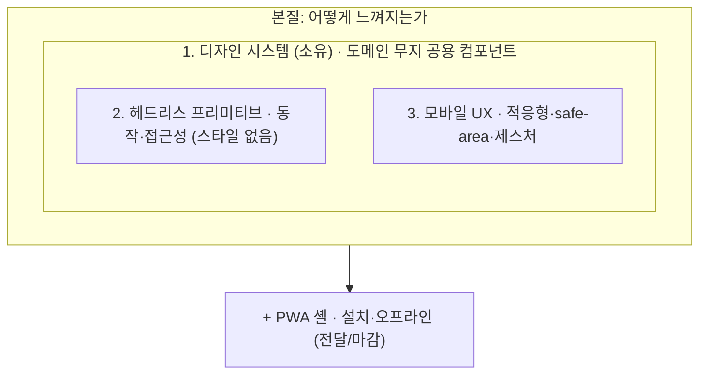

# 모바일 웹 UX 디자인

모바일에서 보는 웹사이트의 사용자 경험을 끌어올리는 설계 방법을 정리한 프로젝트입니다.
바텀시트, 제스처, safe-area, 적응형 내비, 다크/라이트 테마 같은 패턴을 어떻게 설계하고
어디에 책임을 두는지를 다루고, 마지막에 PWA로 마감해 설치와 오프라인까지 닿게 합니다.

핵심은 특정 프레임워크가 아니라 설계 방법입니다. 그 방법을 눈으로 확인할 수 있도록
**데모 코드는 Angular로 구현**했습니다. 같은 원칙은 React나 Svelte로도 옮겨집니다.

## 무엇을 보여 주나

- 적응형 시트: 같은 컨텐츠가 모바일 바텀시트와 데스크톱 모달로 갈립니다. 끌어서 닫기 제스처 포함
- 적응형 내비: 하단 탭바(모바일)와 사이드 레일(데스크톱)
- 제스처: 끌어서 닫기와 스와이프, 속도까지 보는 판정
- safe-area: 노치 기기의 inset 존중 (`viewport-fit=cover`)
- 다크/라이트 테마: 토큰 스왑, 선택 영속화
- 가상 스크롤: 긴 목록도 끊김 없이 (CDK)
- 오프라인과 설치: 서비스 워커 + manifest

## 아키텍처

책임을 네 층으로 나눕니다. 앞의 세 층은 어떻게 느껴지는가를, 마지막 한 층은 어떻게 전달되는가를 맡습니다.



이 도식이 말하는 핵심은, 1층이 아래를 감싸 안는다는 것입니다. 디자인 시스템이 내놓는 것은
도메인을 모르는 순수한 공용 컴포넌트이고, 그 컴포넌트가 안에서 필요한 만큼 헤드리스 동작(2층)과
모바일 UX(3층)를 품습니다. 시트가 그렇습니다. 바깥에는 열림 상태와 컨텐츠만 내보이지만, 안에서는
오버레이와 포커스 트랩을 차용하고 화면 크기에 따라 바텀시트와 모달로 갈리는 분기까지 삼킵니다.
도메인을 아는 화면은 이 순수 프리미티브를 조합해 만들 뿐, 프리미티브는 끝까지 도메인을 모릅니다.

## 디자인 시스템을 소유한다

이 선택을 공정하게 보려면 소유하지 않는 쪽의 이점을 먼저 인정하는 것이 옳습니다. Ionic이나
Material 같은 완성형 라이브러리는 스타일과 동작, 접근성을 한꺼번에 주어 빠르게 출발하게 합니다.
대가는 제어권입니다. 컴포넌트가 마크업을 캡슐화할수록 바깥의 스타일이 안쪽까지 닿지 못하고,
디자인의 상당 부분을 라이브러리의 언어에 위임하게 됩니다.

이 프로젝트는 제어권을 택했습니다. 다만 소유한다고 해서 헤드리스 프리미티브를 처음부터 짜지는
않습니다. 포커스 트랩 같은 동작은 Angular CDK에서 차용하고, 그 위에 배선과 스타일만 얹습니다.
CDK는 헤드리스 프리미티브이기 때문에 마크업을 우리 light DOM에 남기고, 그래서 Tailwind가 모든
요소에 닿습니다. 디자인 자유도와 검증된 동작, 접근성을 동시에 얻기 위한 조합입니다.

> 자세한 설계 결정과 근거는 [docs/](docs/)에, 설계 방법 자체는 스킬
> [skills/mobile-web-ux-design/](skills/mobile-web-ux-design/SKILL.md)에 정리되어 있습니다.

## 스택

Angular 22, Angular CDK, Tailwind v4, GSAP, Dexie(IndexedDB), Angular Service Worker.

## 요구사항

- Node 22 이상 (Angular 22 기준)
- npm

## 빠른 시작

```bash
npm install
npm start
# http://localhost:4200
```

## 데스크톱에서 보기

`npm start` 후 브라우저에서 `http://localhost:4200`을 엽니다. 창 폭을 1024px 경계로 넓혔다 줄이면
시트(모달과 바텀시트)와 내비(레일과 탭바)가 전환되는 것을 볼 수 있습니다.

## 같은 WiFi에서 모바일로 보기

개발 서버를 LAN에 노출합니다.

```bash
npm start -- --host 0.0.0.0
```

PC의 WiFi IPv4 주소를 확인합니다.

```bash
# Windows: "무선 LAN 어댑터 Wi-Fi"의 IPv4 주소
ipconfig
# macOS
ipconfig getifaddr en0
# Linux
hostname -I
```

폰을 같은 WiFi에 두고 `http://<그-IP>:4200`을 엽니다 (예: `http://192.168.0.10:4200`).

> 안 열리면 방화벽이 Node를 막는 경우가 많습니다. 실행 시 뜨는 허용 창에서 개인 네트워크를 허용하세요(Windows).
> 이 방식은 개발 서버라 서비스 워커가 꺼져 있습니다. 모바일 UX는 이걸로 충분히 확인되고,
> 설치와 오프라인은 아래 "PWA 로컬 테스트"를 보세요.

## PWA 로컬 테스트 (설치와 오프라인)

서비스 워커는 프로덕션 빌드에서만 동작합니다. 빌드 후 정적 서버로 띄웁니다.

```bash
npm run build
npx http-server dist/angular-responsive-ux/browser -p 8080 -c-1
# http://localhost:8080
```

데스크톱에서는 `localhost`가 보안 컨텍스트라 그대로 됩니다. DevTools의 Application 탭에서 서비스
워커 등록을 확인하고, Network를 Offline으로 바꿔 새로고침하면 오프라인 동작을 봅니다. 설치는
주소창의 설치 아이콘 또는 앱 안의 설정 → 앱 설치로 합니다.

모바일에서 설치와 오프라인까지 보려면 HTTPS가 필요합니다. LAN IP(`http://192.168...`)는 보안
컨텍스트가 아니라 서비스 워커가 등록되지 않습니다. HTTPS 터널을 쓰세요.

```bash
npx cloudflared tunnel --url http://localhost:8080   # 또는 ngrok
```

출력된 `https://...` 주소를 폰에서 열면 설치와 오프라인을 테스트할 수 있습니다.

## 명령어

```bash
npm start        # 개발 서버 (http://localhost:4200)
npm run build    # 프로덕션 빌드 (dist/)
npm test         # 단위 테스트 (Vitest)
```

## 프로젝트 구조 (Feature-Sliced Design)

```
src/
  app/        # 부트스트랩, 셸, 라우팅, 프로바이더
  pages/      # 라우트 화면 (home, settings)
  widgets/    # 여러 페이지가 쓰는 블록 (app-nav)
  shared/
    ui/       # 디자인 시스템 프리미티브 (Button, Sheet, ListItem, Snackbar, Checkbox)
    lib/      # breakpoint, theme, gsap, liveQuery/localStorage 브리지, pwa-install
    api/      # Dexie DB, TodoStore
  styles.css  # @theme 토큰 + [data-theme=light] 스왑
```

의존은 아래 방향으로만 흐릅니다(app → pages → widgets → shared).

## 문서와 스킬

- [docs/](docs/): 기획, 설계, 구현 문서
- [skills/mobile-web-ux-design/](skills/mobile-web-ux-design/SKILL.md): 설계 방법을 다른 프로젝트에서 재사용할 수 있는 에이전트 스킬
