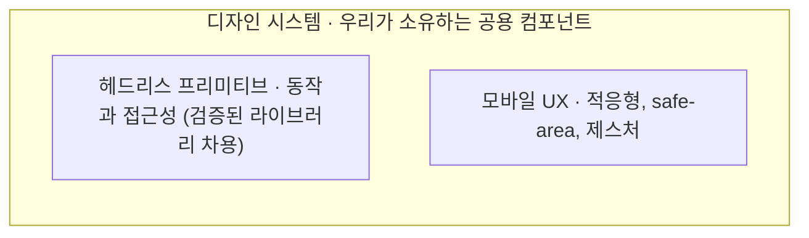

# 모바일 웹 UX 디자인

반응형 웹앱을 모바일에서도 앱처럼 느끼게 만드는 설계 방법을 정리한 프로젝트입니다.
바텀시트, 제스처, safe-area, 적응형 내비, 다크/라이트 테마 같은 패턴을 어떻게 설계하고
어디에 책임을 두는지를 다룹니다.

핵심은 특정 프레임워크가 아니라 설계 방법입니다. 그 방법을 눈으로 확인할 수 있도록
**데모 코드는 Angular로 구현**했습니다. 같은 원칙은 React나 Svelte로도 옮겨집니다.

## 무엇을 보여 주나

- 적응형 시트: 같은 컨텐츠가 모바일 바텀시트와 데스크톱 모달로 갈립니다. 끌어서 닫기 제스처 포함
- 적응형 내비: 하단 탭바(모바일)와 사이드 레일(데스크톱)
- 제스처: 끌어서 닫기와 스와이프, 속도까지 보는 판정
- safe-area: 노치 기기의 inset 존중 (`viewport-fit=cover`)
- 다크/라이트 테마: 토큰 스왑, 선택 영속화
- 가상 스크롤: 긴 목록도 끊김 없이 (CDK)

## 갈림길: 라이브러리에 맡길까, 소유할까

반응형 웹앱의 모바일 UX를 챙기는 가장 쉬운 길은 Ionic이나 Angular Material 같은 완성형
프레임워크를 쓰는 것입니다. 스타일과 동작, 접근성을 한꺼번에 주어 빠르게 출발하게 합니다.
대가는 제어권입니다. 컴포넌트가 마크업을 캡슐화할수록 바깥의 스타일이 안쪽까지 닿지 못하고,
디자인의 상당 부분을 프레임워크의 언어에 위임하게 됩니다.

이 프로젝트는 제어권을 택했습니다. 디자인 시스템의 소유권을 가지면서도, 헤드리스 프리미티브를
처음부터 짜지는 않습니다. 포커스 트랩 같은 동작은 Angular CDK에서 차용하고, 그 위에 배선과
스타일만 얹습니다. CDK는 헤드리스 프리미티브이기 때문에 마크업을 우리 light DOM에 남기고,
그래서 Tailwind가 모든 요소에 닿습니다. 디자인 자유도와 검증된 동작, 접근성을 동시에 얻기 위한
조합입니다.

## 아키텍처

소유하기로 했다면 우리가 만드는 것은 도메인을 모르는 공용 컴포넌트뿐이고, 그 컴포넌트가
헤드리스 동작과 모바일 UX를 안에 품습니다.



시트를 보면 분명합니다. 시트는 바깥으로 열림 상태와 내용만 받고, 화면이 좁으면 바텀시트로
넓으면 모달로 갈리는 판단도 포커스를 가두고 닫는 동작도 전부 컴포넌트 안에 있습니다. 쓰는 쪽은
그 분기를 알 필요가 없습니다. 무엇을 얼마나 품는지는 컴포넌트마다 다르고(버튼은 거의 품지 않고
시트는 많이 품습니다), 도메인을 아는 화면은 이 공용 컴포넌트를 조합해 만들 뿐입니다.

> 자세한 설계 결정과 근거는 [docs/](docs/)에, 설계 방법 자체는 스킬
> [skills/mobile-web-ux-design/](skills/mobile-web-ux-design/SKILL.md)에 정리되어 있습니다.

## 스택

Angular 22, Angular CDK, Tailwind v4, GSAP, Dexie(IndexedDB).

## 요구사항

- Node 22 이상 (Angular 22 기준)
- npm

## 빠른 시작

```bash
npm install
npm start
# http://localhost:4200
```

## 데스크톱에서 보기

`npm start` 후 브라우저에서 `http://localhost:4200`을 엽니다. 창 폭을 1024px 경계로 넓혔다 줄이면
시트(모달과 바텀시트)와 내비(레일과 탭바)가 전환되는 것을 볼 수 있습니다.

## 같은 WiFi에서 모바일로 보기

개발 서버를 LAN에 노출합니다.

```bash
npm start -- --host 0.0.0.0
```

PC의 WiFi IPv4 주소를 확인합니다.

```bash
# Windows: "무선 LAN 어댑터 Wi-Fi"의 IPv4 주소
ipconfig
# macOS
ipconfig getifaddr en0
# Linux
hostname -I
```

폰을 같은 WiFi에 두고 `http://<그-IP>:4200`을 엽니다 (예: `http://192.168.0.10:4200`).
실제 터치 환경이라 끌어서 닫기나 스와이프 같은 제스처를 제대로 확인하기 좋습니다.

> 안 열리면 방화벽이 Node를 막는 경우가 많습니다. 실행 시 뜨는 허용 창에서 개인 네트워크를 허용하세요(Windows).

## 명령어

```bash
npm start        # 개발 서버 (http://localhost:4200)
npm run build    # 프로덕션 빌드 (dist/)
npm test         # 단위 테스트 (Vitest)
```

## 프로젝트 구조 (Feature-Sliced Design)

```
src/
  app/        # 부트스트랩, 셸, 라우팅, 프로바이더
  pages/      # 라우트 화면 (home, settings)
  widgets/    # 여러 페이지가 쓰는 블록 (app-nav)
  shared/
    ui/       # 디자인 시스템 프리미티브 (Button, Sheet, ListItem, Snackbar, Checkbox)
    lib/      # breakpoint, theme, gsap, liveQuery/localStorage 브리지
    api/      # Dexie DB, TodoStore
  styles.css  # @theme 토큰 + [data-theme=light] 스왑
```

의존은 아래 방향으로만 흐릅니다(app → pages → widgets → shared).

## 문서와 스킬

- [docs/](docs/): 기획, 설계, 구현 문서
- [skills/mobile-web-ux-design/](skills/mobile-web-ux-design/SKILL.md): 설계 방법을 다른 프로젝트에서 재사용할 수 있는 에이전트 스킬
