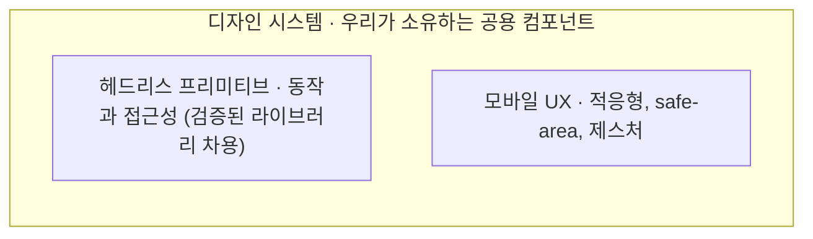

# 모바일 웹 UX 디자인

반응형 웹앱을 만들고 나면 데스크톱에서는 멀쩡하던 화면이 모바일에서는 어딘가 웹 티가 난다. 이 스킬은 그 간극을 좁혀 모바일에서도 앱처럼 느끼게 만드는 설계 방법을 다룬다. 다루는 것은 방법이지 특정 프레임워크가 아니다. 다만 설명을 구체적으로 하기 위해 예제는 Angular(CDK, Tailwind v4, GSAP)로 든다. 같은 방법을 React나 Svelte로 옮길 때 무엇을 쓰면 되는지는 각 자리에서 짚는다.

## 언제 쓰나

모바일에서 바텀시트나 모달, 끌어서 닫기, 스와이프 같은 터치 제스처가 필요할 때 이 스킬을 쓴다. 화면 크기에 따라 레이아웃이 아니라 표현 자체가 바뀌어야 할 때(바텀시트와 모달, 탭바와 사이드 레일), safe-area나 44px 터치 타깃, 다크/라이트 같은 모바일 디테일을 챙겨야 할 때도 맞는다. 완성된 UI 프레임워크를 채택할지 디자인을 직접 소유할지 저울질하는 단계에도 도움이 된다.

## 갈림길: 라이브러리에 맡길까, 소유할까

가장 쉬운 길부터 인정하고 시작하는 편이 좋다. Ionic이나 Angular Material 같은 완성형 프레임워크는 스타일과 헤드리스 동작을, Ionic이라면 모바일 UX의 상당 부분까지 한꺼번에 준다. 검증된 접근성과 빠른 출발이 그 보상이고, 작은 팀이 빨리 출시해야 한다면 합리적이다.

대가는 제어권이다. 컴포넌트가 마크업을 캡슐화할수록 바깥에서 정의한 스타일이 안쪽까지 닿지 못하고, 디자인의 상당 부분을 프레임워크의 언어에 맡기게 된다. 결과물이 그 프레임워크처럼 보이는 것을 피하기 어렵다.

디자인 시스템의 소유권을 가지려는 쪽은 제어권을 되찾는 대신 시간과 전문성을 치른다. 한 가지 오해는 짚어 두자. 소유한다고 해서 헤드리스 동작까지 직접 짜는 것은 아니다. 포커스 트랩이나 오버레이 같은 동작은 검증된 라이브러리에서 차용하고, 그 위에 배선과 스타일만 얹는다. 소유란 외형을 소유하고 동작을 빌리는 일이다. 이 스킬은 소유하는 길을 다룬다.

## 공용 컴포넌트가 두 가지를 품는다

소유하기로 했다면 구조는 단순하다. 우리가 만드는 것은 도메인을 모르는 공용 컴포넌트뿐이고, 그 컴포넌트가 헤드리스 동작과 모바일 UX를 안에 품는다.

시트를 보면 분명하다. 시트는 바깥으로 열림 상태와 내용만 받는다. 화면이 좁으면 바텀시트로, 넓으면 모달로 갈리는 판단도, 포커스를 가두고 백드롭으로 닫는 동작도 전부 컴포넌트 안에 있어서 쓰는 쪽은 그 분기를 알 필요가 없다. 무엇을 얼마나 품는지는 컴포넌트마다 다르다. 버튼은 거의 품지 않고 시트는 많이 품는다. 도메인을 아는 화면은 이 공용 컴포넌트를 조합해 만들 뿐, 컴포넌트는 끝까지 도메인을 모른다.

## 프레임워크에 맞는 라이브러리를 고른다

헤드리스 동작과 제스처는 직접 짜기 어렵고 틀리기 쉬우니 검증된 라이브러리를 차용한다. 참조 구현은 Angular라 동작과 접근성은 CDK(오버레이, 포커스 트랩, 브레이크포인트, 가상 스크롤)에서, 제스처와 모션은 GSAP에서 가져온다. 다른 환경이라면 그 환경에서 검증된 것을 리서치해 같은 자리에 끼우면 된다. 헤드리스는 React의 Radix나 React Aria, Svelte의 Melt나 Bits가 있고 포지셔닝은 Floating UI가 프레임워크에 무관하다. 제스처와 모션은 GSAP이 어디서나 쓰이고 React에는 @use-gesture 같은 선택지가, 가상 스크롤은 TanStack Virtual이 여러 프레임워크를 함께 지원한다. 이 목록은 예시일 뿐 처방이 아니다. 핵심은 이런 동작을 직접 만들지 말고, 내 환경에서 검증된 것을 골라 디자인 시스템 컴포넌트 안에 감추는 것이다.

## 쌓는 순서

먼저 토큰을 깐다. 색, 간격, 라운드, 브레이크포인트, 타이포를 정해 두지 않으면 그 위의 모든 시각 작업이 흔들린다([references/01-design-system.md](references/01-design-system.md)).

다음으로 헤드리스 라이브러리를 골라 오버레이, 포커스 트랩, 브레이크포인트 관찰을 손에 넣는다([references/02-headless-primitives.md](references/02-headless-primitives.md)). 그 위에서 적응형 시트를 가장 먼저 만든다. 시트는 오버레이와 포커스 가둠, 화면별 분기, 제스처, safe-area를 한자리에 모으기 때문에, 이것이 서면 나머지 모바일 UX 패턴은 같은 방식을 따라간다([references/03-adaptive-ux.md](references/03-adaptive-ux.md)).

## 변치 않는 원칙

디자인 시스템은 클래스 이름이 아니라 컴포넌트를 노출한다. Tailwind 클래스를 밖으로 흘리면 그것이 사실상의 API가 되어 이후 내부를 바꾸기 어려워지므로, 클래스는 컴포넌트 안에 가둔다.

접근성은 헤드리스 층에 둔다. 포커스, 키보드, ARIA, 알림은 외형이 아니라 동작과 의미의 문제다. 동작 층에 두면 스타일을 바꿔도 접근성이 깨지지 않는다.

열고 닫는 애니메이션은 transform과 opacity만 건드린다. 레이아웃을 건드리지 않아야 컴포지터에서 부드럽게 돈다.

제스처는 거리만이 아니라 속도까지 본다. 얼마나 끌었는지와 얼마나 빨리 던졌는지를 함께 봐야 닫을지 되돌릴지 판정이 자연스럽다.

## 참조 구현

이 스킬은 방법만 담는다. 전체 코드 예제는 별도 GitHub 레포에 있다(이 스킬 폴더에는 포함되지 않는다).

https://github.com/dev-goraebap/mobile-web-ux-design (Angular 22 + CDK + Tailwind v4)

그 레포에서 다음 경로를 보면 된다.

- 토큰: `src/styles.css`
- 프리미티브: `src/shared/ui/` (Button, Sheet, ListItem, Snackbar, Checkbox)
- 적응형 기준점: `src/shared/lib/breakpoint.ts`
- 제스처 공통: `src/shared/lib/gsap.ts`
- 적응형 시트(참조 구현의 심장): `src/shared/ui/sheet/sheet.ts`
- 적응형 내비: `src/widgets/app-nav/app-nav.ts`
